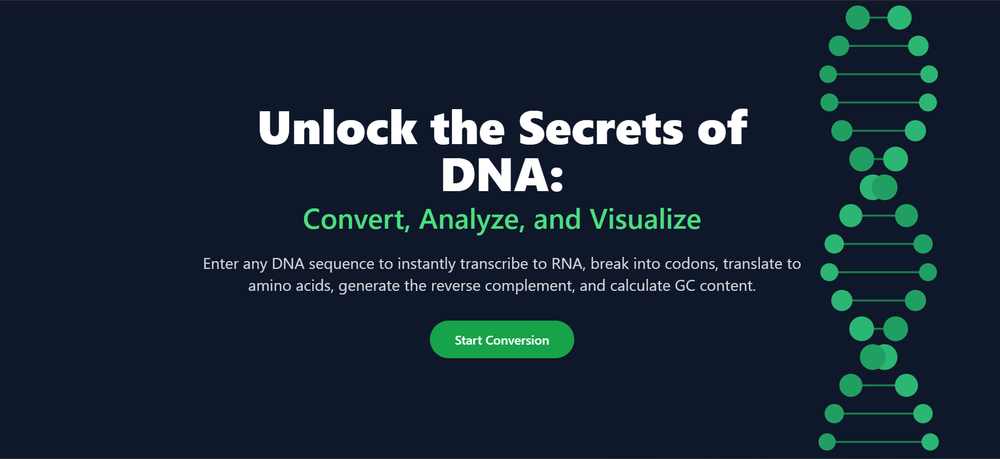
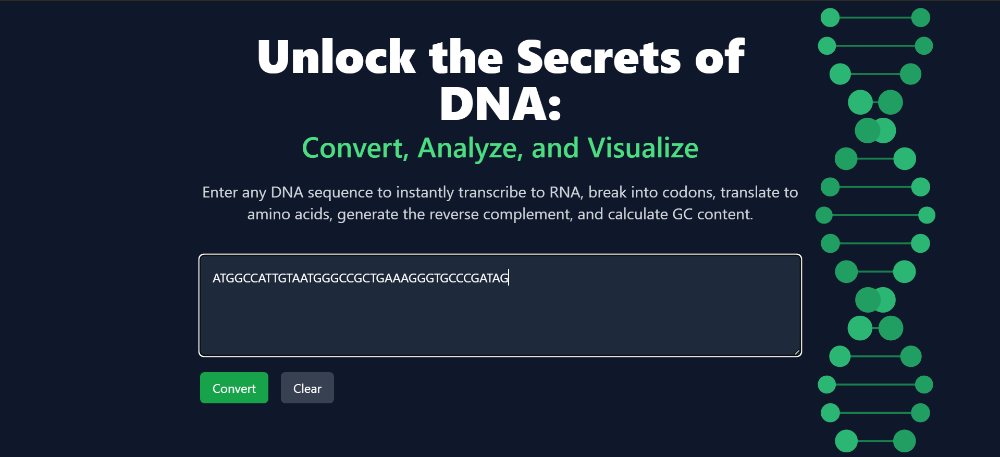
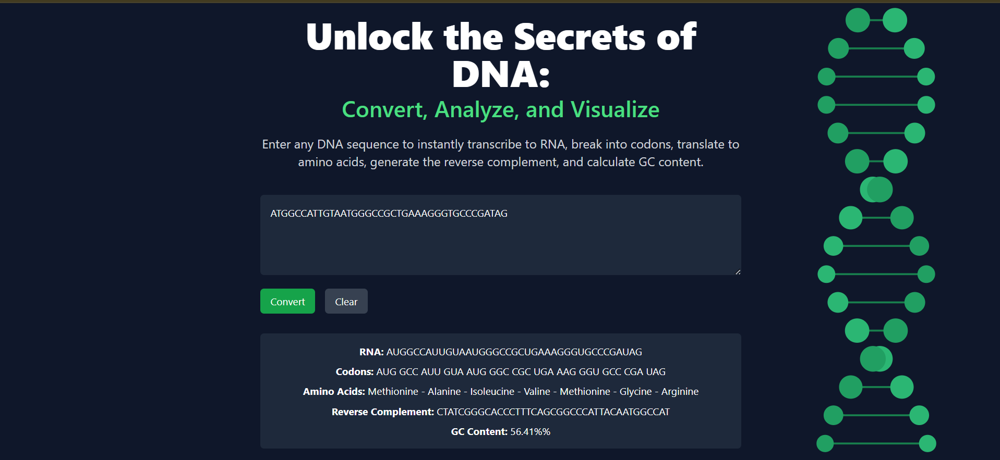

# 🧬 DNA Converter API 

A blazing-fast, science-powered API & frontend combo that converts raw DNA sequences into RNA, codons, amino acids, reverse complements, and GC content — perfect for students, researchers, and science nerds 🧠💥


- 🔁 **Transcribe DNA to RNA**  
  Converts your DNA input into its RNA counterpart using simple base-pair substitution (A → U, T → A, G ↔ C).

- 🔗 **Generate Codons**  
  Groups the RNA sequence into codons (triplets) for further processing and understanding of genetic code translation.

- 🧬 **Translate Codons to Amino Acids**  
  Maps each codon to its corresponding amino acid using the standard genetic code — forming the basis of protein synthesis.

- 🧪 **Reverse Complement**  
  Computes the reverse complement of a DNA sequence — a common operation in bioinformatics for analyzing the opposite strand.

- 📊 **GC Content Calculation**  
  Calculates the percentage of Guanine (G) and Cytosine (C) bases in the sequence — a critical measure in DNA stability and genome analysis.


## ✨ Features

- 🔬 Convert DNA → RNA, Codons, Amino Acids
- 🧠 Calculate GC Content & Reverse Complement
- ⚡ FastAPI-powered Public API
- 💻 Interactive, animated frontend with DNA motion visuals
- 🧪 Built for life sciences, bioinformatics, and education
- 🌐 Publicly accessible — ready to be adopted by the world

---

## 🧠 How It Works

1. **Frontend UI** allows users to paste DNA sequences.

2. On form submission, the frontend hits our custom-built **FastAPI** backend.
3. The backend processes:
   - DNA → RNA conversion
   - Splits RNA into codons
   - Translates codons into amino acids
   - Computes GC content
   - Finds reverse complement
4. Results are displayed instantly on the frontend.

---

## 🛠️ Installation & Run Instructions

### 🔧 Backend (FastAPI)

```bash
git clone https://github.com/kamalan2k4/stackup-hackathon-dna-coverter-api.git
cd dna-converter-api
python -m venv venv
source venv/bin/activate  # Or venv\Scripts\activate on Windows
pip install -r requirements.txt
bash run.sh
```

Runs on: `http://localhost:8000`

---

### 🎨 Frontend (Next.js)

```bash
git clone https://github.com/kamalan2k4/stackup-hackathon-dna-coverter-api.git
cd dna-converter-frontend
npm install
npm run dev
```

Runs on: `http://localhost:3000`

Make sure the backend is running at `http://localhost:8000` — the frontend is configured to talk to it directly.

---

## 🖼️ Screenshots

### Homepage with DNA animation


### Input Sequence Form


### Result Section


---

## 🧱 Tech Stack

- 🐍 Python 3 + FastAPI
- 🧬 BioPython
- ⚛️ React + Next.js
- 🎨 TailwindCSS + Lottie for animations
- 🌐 Public API (REST)
- 🔁 JSON response structure

---

## 🤔 Why Use DNA Converter API?

Whether you're a bio student decoding codons, a researcher experimenting with sequences, or an educator simplifying genomics, this tool gives you:

- 🎓 Instant bio-sequence insight
- 🧩 Developer-friendly API
- 📊 Clear, visual results
- 🔥 A frontend that makes science feel futuristic

---


## 🙌 Credits

Made with 💙 under the **Build Your Own Public API Challenge** — pushing boundaries between code and science.
